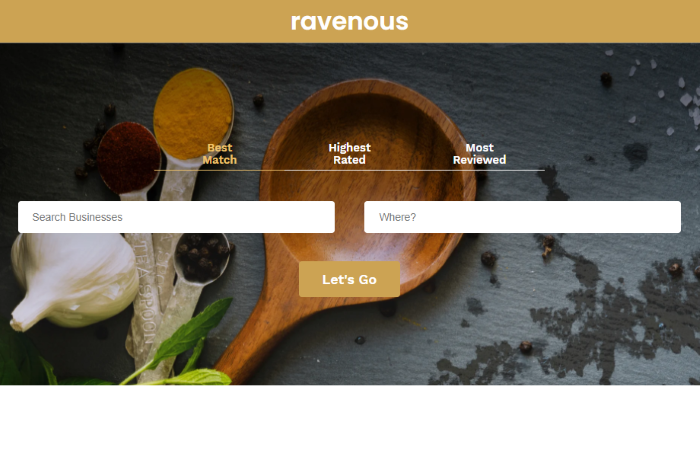

# Codecademy Ravenous React App
<https://ravenous-jarrett-d.herokuapp.com/> \
Version 1.0 \
Date - Nov 19, 2020\
By Jarrett Dougherty

<kbd></kbd>

## Description
This is a React.js project from Codecademy to create a website which can search businesses by location. The app uses the Yelp API.

## Instructions For Use
### Getting Started 
1. Simply click the link to start the web app.

<https://ravenous-jarrett-d.herokuapp.com/>

2. Enter a `Business Type` and a `Location`. Location can be either a city's name or a zipcode.

3. Listings for that `Business Type` in the choosen `Location` will display.

# Technologies Used
* React.js
* HTML
* CSS
* JavaScript
* RESTful APIs